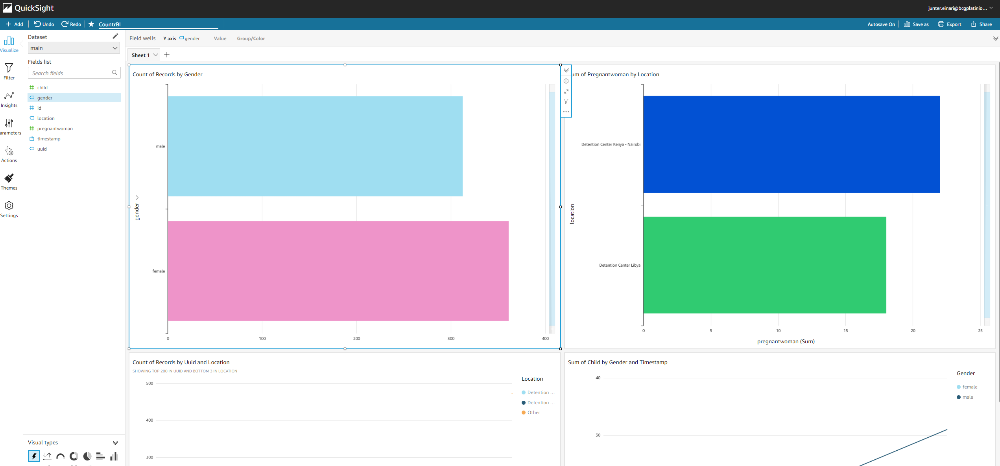

# Team Countr.IO

The goal of our team was to solve real-world problem of MSF to efficiently counting people in detention centers. This readme explains our solution to the problem.

Team members:
- William
- Ruby
- Einari
- Petri

## Backend/Server

[Server folder](./server) contains the code for our backend. It consists of a local instance of Postgres database and a NodeJS/Express server application that transforms the database operatoins into API calls.

The code was run on a Raspberry Pi W Zero and was fully operational on local network that the mobile app was able to access to.

Additionally the folder contains a "Push to AWS" function that could be triggered from a API call within local network, but would require a working connection to internet to actually upload recorded data into AWS.

## RFID counter

[RFID counter folder](./rfid_counter) contains code that we used to simulate our idea of identifying people using RFID tags on bracelets. For the purpose of demoing and unavailability of RFID we used a motion sensor and simulated poeple data that gets stored to local Postgres database using an API call when people walk by the sensor.

The "RFID counter" motion sensor was run on the same Raspberry PI as the backend server during the demo, but could be very easily be replaced with actual RFID reader(s) runninng on other device(s) within the same local network as the interaction happens through the server's API.

## Mobile App

[Mobile app folder](./mobile_app) contains the code for mobile application developed using Flutter. The app works together with the backend server on a local network and has multiple functionalities including showing real-time data of the count, scanning a QR code that is on the bracelets in addition to the RFID and more.

The design of the application was done using Canva and can be found for the app and the bracelets as follows:
- [Mobile app](https://www.canva.com/design/DAEuNVZWmvQ/avuhvh3r2qiWbwwR9ESX5w/watch?utm_content=DAEuNVZWmvQ&utm_campaign=designshare&utm_medium=link&utm_source=publishsharelink)
- [Bracelet](https://www.canva.com/design/DAEuOeytACI/klGAneWZyF-kUc_bNswmdA/watch?utm_content=DAEuOeytACI&utm_campaign=designshare&utm_medium=link&utm_source=publishsharelink)

## AWS

For central monitoring purposes across detention centers a cloud-based Postgres database was hosted on AWS to combine the data from various visits that MSF does.

To visualize the data AWS QuickSight dashboard was created (example below):
